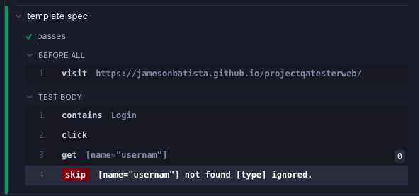
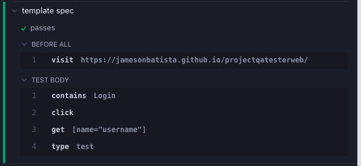
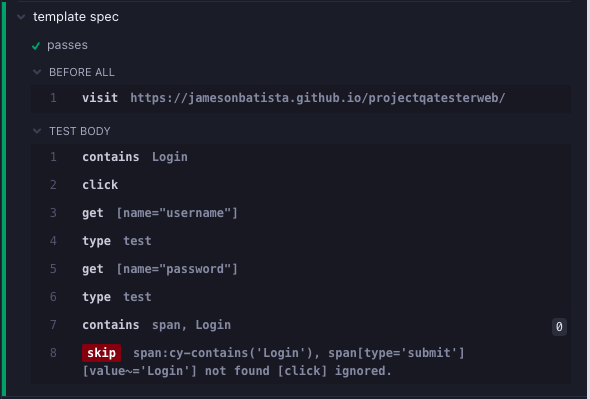
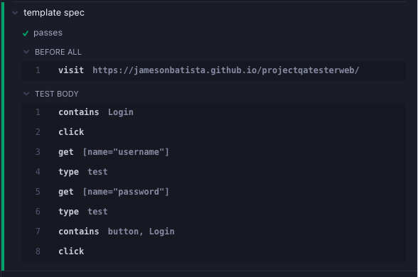
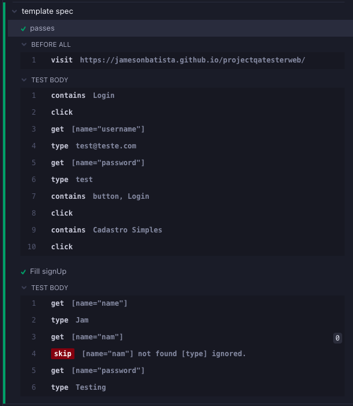
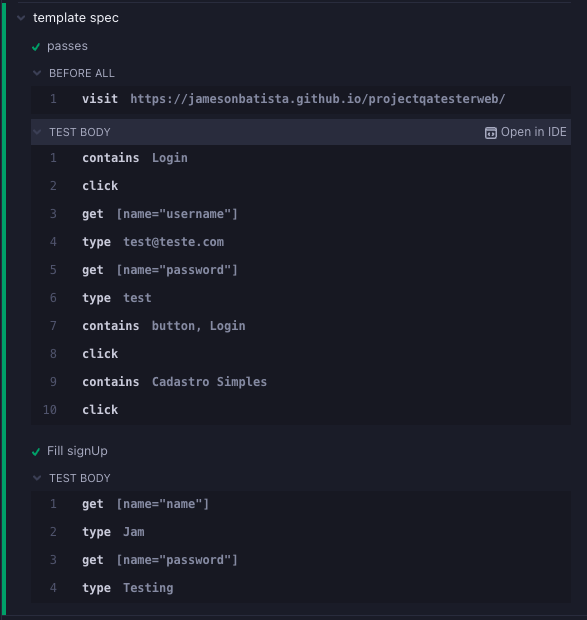

# cypress-onif 


[](https://npmjs.com/package/cypress-onif)
[](https://npmjs.com/package/cypress-onif)
[](https://npmjs.com/package/cypress-onif)
[](https://npmjs.com/package/cypress-onif)


## Install

Add this package as a dev dependency

```
$ npm i -D cypress-onif
# or using Yarn
$ yarn add -D cypress-onif
```

## import

```js
// command.js

import ('cypress-onif')

```

# ⚙️ Use

## 1
```js
describe("template spec", () => {
  before(() => {
    cy.visit("https://jamesonbatista.github.io/projectqatesterweb/");
  });
  it("passes", () => {
    cy.contains("Login").click();
    cy.get('[name="usernam"]').onif().type("test");

  });
});


```


### ✅ correct



## 2 

```js
describe("template spec", () => {
  before(() => {
    cy.visit("https://jamesonbatista.github.io/projectqatesterweb/");
  });
  it("passes", () => {
    cy.contains("Login").click();
    cy.get('[name="username"]').onif().type("test");

    cy.get('[name="password"]').onif().type("test");

    cy.contains("span", "Login").onif().click();
  });
});
```


## ✅ correct



## 3

```js

describe("template spec", () => {
  before(() => {
    cy.visit("https://jamesonbatista.github.io/projectqatesterweb/");
  });
  it("passes", () => {
    cy.contains("Login").click();
    cy.get('[name="username"]').onif().type("test@teste.com");

    cy.get('[name="password"]').onif().type("test");

    cy.contains("button", "Login").onif().click();

    cy.contains('Cadastro Simples').click()
  });

  it('Fill signUp', () => {
      getBy(['[name="name"]']).type('Jam')

      // error
      getBy(['[name="nam"]']).type('Jam')

      getBy('[name="password"]').type('Testing')
  });
});


function getBy(params) {
  if(Array.isArray(params)){
    return cy.get(params[0]).onif()
  }
  return cy.get(params)
}
```



## ✅ correct

